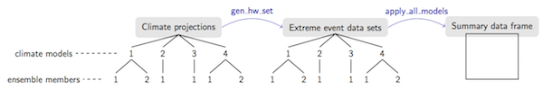
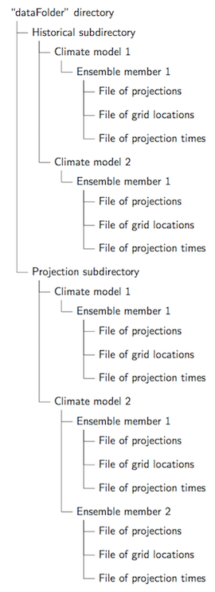

```{r echo = FALSE, message = FALSE, warning = FALSE}
library(futureheatwaves)
library(ggplot2)
```

## What the `futureheatwaves` does

Ensemble techniques are growing in popularity for climate impact research [@IPCCch1]. With these techniques, researchers simulate impacts under future scenarios by using simulations from many different climate models, some of which have multiple ensemble members. The scope of this data means that researchers often must spend a lot of time writing code scripts to process the data from different climate models or ensemble members. This is the case, for example, in studying the impacts of heat waves and other multi-day extreme events under climate change, since multi-day events must be identified and characterized for each climate model and ensemble member before impacts can be simulated. We have created this package to automate this process in a way that still allows extensive customization by the user in choices like how to define the extreme event. Further, extreme events are often defined based on what is rare at a location, rather than absolute thresholds [@IPCCch1]. Therefore, this package includes the capability to use extreme event definitions based on location-specific relative thresholds.  

The `futureheatwaves` package can process climate files, which are stored locally on your computer, to generate a list of the extreme events in each projection as well as characteristics of each event (e.g., length, intensity, timing in the year). You can identify extreme events based either on a default heat wave definition (two or more days with temperatures at or above the community's $98^{th}$ percentile of year-round temperature), or you can write your own R function to use any definition of your choice. This functionality allows you to either pick a custom heat wave definition or to identify other types of multi-day extreme events, like cold waves, frost day spells, periods of high or low precipitation, and severe air pollution episodes. The package identifies events at specific locations (e.g., cities), which the user specifies in an input file that lists each location and its latitude and longitude. Data frames with the identified and characterized events for each ensemble member of each climate model are output as files in a directory specified by the user. Once you have created these datasets of extreme events, the package also allows you to explore those events using custom functions. This functionality can be used to generate summary statistics (e.g., determine average heat wave length or total heat wave days) or can be used to apply more complex functions (e.g., apply epidemiological effect estimates across the heat waves to generate health impact estimates). 

The following figure gives an overview of this package functionality. To use the package, you start with a directory of climate model output formatted in a specific way, with output from one or more climate models and one or more ensemble member of each model. The `gen_hw_set` function processes these files to identify and characterize the extreme events in each climate model ensemble member and writes out a directory with these extreme events datasets. Finally, the `apply_all_models` function can be used to apply functions across all of the extreme event datasets, for example to determine the average length and intensity of each event in each study location and ensemble member.

```{r echo = FALSE, fig.align = "center"}

```

To use this package, you will need to have climate model output data (or data from another type of model, like an air pollution model) saved locally on your computer in a specific format. The exact details of this required format are explained later in this document. Further, if you plan to use CMIP5 climate model output data, you will need to download and process that data, so the `futureheatwaves` package includes another vignette called "starting_from_netcdf" the provides an overview of CMIP5 netCDF files, how to work with them in R, and a script for processing them in preparation for using the `futureheatwaves` package. Once the user has completed preprocessing and directory set-up, the package allows the user to quickly process data from many projections, generate extreme events data sets for each, and apply custom functions across each extreme event dataset.

## A basic example of using the package

This package requires you to have data on community locations and climate projections set up in a specific way on your local computer. You then use arguments in the main package function, `gen_hw_set`, to direct the function to these files so it can process them and output datasets of extreme events that were identified and characterized for each climate model ensemble member. These final extreme event files will be written out to your local computer, in a directory that you select and specify through `gen_hw_set`. You can then apply user-created R functions to all heat waves in the output using the `apply_all_models` function. Other functions in the package either serve as helper functions for these two main functions or provide further features (e.g., mapping study locations and their matching points from the climate model grid). In this section of the vignette, we provide a basic example of this process, using example climate model output data that is included with the package.

### Example data

Within the `futureheatwaves` package, we have included example data, so users can try this package before applying it to their own directory of climate model output files. Some example files are included as comma-separated (.csv) files, rather than as saved R objects, because the `gen_hw_set` function requires a directory of comma-separated files as input. This example data also allows users to see how to create the appropriate directory set-up for this package. 

Once the`futureheatwaves` package is installed and loaded, the user can find the local location of these files using R's `system.file` function. For example, one of the example files is a csv of city locations. You can find the path to this file on your own computer with the call:

```{r}
system.file("extdata/cities.csv", package = "futureheatwaves")
```

To open this file from the R command line, you can run: 

```{r eval = FALSE}
city_filepath <- system.file("extdata/cities.csv", package = "futureheatwaves")
file.edit(city_filepath)
```

This example data includes the "cities.csv" file with example locations previously shown. It also includes example data from CMIP5 climate models. This example data comes from two climate models that are a part of CMIP5 [@taylor2012overview]: (1) the model of the Beijing Climate Center, China Meteorological Administration (BCC) [@xin2013] and (2) the National Center for Atmospheric Research's (NCAR's) Community Climate System Model, version 4 (CCSM4) [@gent2011]. We include one ensemble member from BCC (r1i1p1) and two from CCSM (r1i1p1 and r2i1p1). To ensure that the size of this example data is reasonably small, we have only included projection data for grid points from these climate models that are near five U.S. east coast cities: New York, NY; Philadelphia, PA; Newark, NJ; Baltimore, MD, and Providence, RI. Further, to keep the file sizes reasonably small, the historical projections range over the years 1990 to 1999, while the future projections are limited to 2060 to 2079. Users' applications of this package will likely use directories with many more climate model ensemble members and more locations; however, the operation of the package is the same for this smaller example application as it would be for a much larger application.

These files are in the directory structure and format required for processing with the `futureheatwaves` function. This format is described in full detail later in the vignette. You can see a listing of these example files by running: 

```{r}
list.files(system.file("extdata/cmip5", package = "futureheatwaves"),
           recursive = TRUE)
```

### Processing climate projections with the example data

To process this example climate model output data at the study locations listed in the example "cities.csv" file and save the output files to a directory called `example_results` in the current working directory, the user can run: 

```{r eval = FALSE}
# Identify location of example files
projection_dir_location <- system.file("extdata/cmip5",
                                       package = "futureheatwaves")
city_file_location <- system.file("extdata/cities.csv",
                                  package = "futureheatwaves")

# Process example files
gen_hw_set(out = "example_results",
           dataFolder = projection_dir_location ,
           dataDirectories = list("historical" = c(1990, 1999),
                                        "rcp85" = c(2060, 2079)),
           citycsv = city_file_location,
           coordinateFilenames = "latitude_longitude_NorthAmerica_12mo.csv",
           tasFilenames = "tas_NorthAmerica_12mo.csv",
           timeFilenames = "time_NorthAmerica_12mo.csv")
```

This code first identifies and saves as objects the path names on the user's computer of the example climate projections directory (`projection_dir_location`) and the file of study locations (`city_file_location`). The `gen_hw_set` function then processes this example input and creates a new directory, `example_results`, with files of identified and characterized heat waves, in the user's current working directory. In this example code, this processing is done using default values for the heat wave definition, years for which to generate the heat wave data sets, etc. Ways to customize these choices are fully explained later in the vignette.

In this call, the user must specify the directory where the results should be written (`out`), the location of the directory of climate projections (`dataFolder`), the names of the two main subdirectories of that climate projection directory, as well as their year boundaries (`dataDirectories`; this set-up is explained below), the file path of the city location file (`citycsv`) on the local computer, and the names used for the grid coordinate, climate projection, and projection date files (`coordinateFilenames`, `tasFilenames`, and `timeFilenames`; the set-up for these files is also explained fully later in the vignette). When `gen_hw_set` is run, the user is advised that the function will write files to his computer and must agree to proceed: 

```
 Warning: This function will write new files to your computer in the 
 ~/tmp/results/ directory of your computer. If that directory already exists,
running this function will write over it. 
 Do you want to continue? (y / n): 
```

This warning reminds you that this function will create subdirectories and write out files to the directory you specified when defining `out`. If you agree that it is okay to write files and subdirectories to this directory, enter "y" at the prompt, and the function will continue running. (If you do not want to get this warning when running the function-- for example, when looping and calling this function repeatedly-- choose the option `printWarning = FALSE` when calling `gen_hw_set`.)

You should get output that looks something like this:

```
Processing thresholds for bcc1 
Reading ---> r1i1p1 
Read operation complete 
Processing projections for bcc1 
Reading ---> r1i1p1 
Read operation complete 
Creating dataframe ~~ City:  balt  ~~ City Number:  1  ~~ Cutoff:  302.1802 
Creating dataframe ~~ City:  ny  ~~ City Number:  2  ~~ Cutoff:  298.7704 
Creating dataframe ~~ City:  nwk  ~~ City Number:  3  ~~ Cutoff:  298.7704 
Creating dataframe ~~ City:  phil  ~~ City Number:  4  ~~ Cutoff:  302.1802 
Creating dataframe ~~ City:  prov  ~~ City Number:  5  ~~ Cutoff:  296.76 
Writing bcc1: r1i1p1
Processing thresholds for ccsm 
Reading ---> r1i1p1 
Read operation complete 
Processing projections for ccsm 
Reading ---> r1i1p1 
Read operation complete 
Creating dataframe ~~ City:  balt  ~~ City Number:  1  ~~ Cutoff:  301.4408 
Creating dataframe ~~ City:  ny  ~~ City Number:  2  ~~ Cutoff:  300.49 
Creating dataframe ~~ City:  nwk  ~~ City Number:  3  ~~ Cutoff:  300.49 
Creating dataframe ~~ City:  phil  ~~ City Number:  4  ~~ Cutoff:  300.6204 
Creating dataframe ~~ City:  prov  ~~ City Number:  5  ~~ Cutoff:  300.3104 
Writing ccsm: r1i1p1
Processing projections for ccsm 
Reading ---> r2i1p1 
Read operation complete 
Creating dataframe ~~ City:  balt  ~~ City Number:  1  ~~ Cutoff:  301.4408 
Creating dataframe ~~ City:  ny  ~~ City Number:  2  ~~ Cutoff:  300.49 
Creating dataframe ~~ City:  nwk  ~~ City Number:  3  ~~ Cutoff:  300.49 
Creating dataframe ~~ City:  phil  ~~ City Number:  4  ~~ Cutoff:  300.6204 
Creating dataframe ~~ City:  prov  ~~ City Number:  5  ~~ Cutoff:  300.3104 
Writing ccsm: r2i2p2
Writing accumulators 
All operations completed. Exiting. 

  modelName length.histens. length.rcpens.
1      bcc1               1              1
2      ccsm               1              2
```

The `gen_hw_set` function provides status reports on its progress in generating the heat wave projections. This helps you see that the function call is progressing, as this process can take a while if you include many cities and / or many climate model projections. 

Once the function has completed running, you will have one new subdirectory in the `out` directory called "Heatwaves". This directory will contain data frames with all identified and characterized extreme events for each ensemble member of each climate model in the input directory (`dataFolder`). The `out` directory will also have a file called `hwModelInfo.csv` that contains some basic information about the climate models and the number of ensemble members included for each as well as `locationList.csv`, a file that gives the closest climate model grid point to each community for each climate model.

The full output directory structure will look something like the following figure:

```{r echo = FALSE, fig.align = "center"}

```
    
Each of the extreme events files will have one event per row, covering all the events identified for that particular climate model ensemble member in each study location. The data frame has the following columns with characteristics of each extreme event: 

- `hw.number`: The number of the event out of all extreme events identified in the location;
- `mean.var`: Average value of the variable (e.g., temperature) across days in the event (e.g., heat wave), in the units in which the variable is expressed in the input files;
- `max.var`: Highest value of the variable across days in the event, in the units in which the variable is expressed in the input files;
- `min.var`: Lowest value of the variable across days in the event, in the units in which the variable is expressed in the input files;
- `length`: Number of days of the event;
- `start.date`: Date of the first day of the event;
- `end.date`: Date of the last day of the event;
- `start.doy`: Day of the year of the first day of the event (1 = Jan. 1, etc.);
- `start.month`: Month in which the event started (1 = January, etc.);
- `days.above.abs.threshold.1`: Number of days in the event above a certain absolute threshold (default is $80^oF$, but this and the absolute thresholds used for the following three variables can be customized using the `absolute_threshold` parameter in the `gen_hw_set` function). When identifying extreme events below a threshold, this column is replaced with `days.below.abs.threshold.1`;
- `days.above.abs.threshold.2`: Number of days in the event above a certain absolute threshold (default is $85^oF$. When identifying extreme events below a threshold, this column is replaced with `days.below.abs.threshold.2`);
- `days.above.abs.threshold.3`: Number of days in the event above a certain absolute threshold (default is $90^oF$). When identifying extreme events below a threshold, this column is replaced with `days.below.abs.threshold.3`;
- `days.above.abs.threshold.4`: Number of days in the event above a certain absolute threshold (default is $95^oF$). When identifying extreme events below a threshold, this column is replaced with `days.below.abs.threshold.3`;
- `days.above.99th`: Number of days in the event above the $99^{th}$ percentile year-round value of the variable for the location, using the period specified by the user with the `referenceBoundaries` argument in `gen_hw_set` as a reference for determining these percentiles (this reference period is explained in more depth later in the vignette). When identifying extreme events below a threshold, this column is replaced with `days.below.1st`;
- `days.above.99.5th`: Number of days in the event above the $99.5^{th}$ percentile year-round value of the variable for the location, using the period specified by the user with the `referenceBoundaries` argument in `gen_hw_set` as a reference for determining these percentiles. When identifying extreme events below a threshold, this column is replaced with `days.below.0.5th`;
- `first.in.year`: Whether the event was the first to occur in its calendar year in its location (Note: this characteristic is likely not useful for events whose season spans Jan. 1, like cold spells or southern hemisphere heat waves.);
- `threshold`: The variable value used as the threshold for the event definition in the location;
- `mean.var.quantile`: The percentile of the average variable value during the event compared to the location's year-round variable distribution, based on the variable values for the city during the period specified by the `referenceBoundaries` argument in `gen_hw_set`;
- `max.var.quantile`: The percentile of the highest variable value during the event compared to the location's year-round variable distribution;
- `min.var.quantile`: The percentile of the lowest variable value during the event compared to the location's year-round variable distribution;
- `mean.yearround.var`: The location's average year-round variable value, based on the variable distribution for the location during the period specified by the `referenceBoundaries` argument in `gen_hw_set`;
- `mean.seasonal.var`: The location's average seasonal variable value (by default, the season is May--September, although the months included for this seasonal metric can be changed using the `seasonal_months` parameter in the `gen_hw_set` function), based on the variable values for the location during the years specified by the `referenceBoundaries` argument in `gen_hw_set`; and
- `city`: A unique identifier for the location, as given in the file specified in the `citycsv` argument of `gen_hw_set`.

An example of one of these heat wave data frames is given in the `hw_datafr` data set included with the package. You can load and explore this example data frame: 

```{r}
data(hw_datafr) 
head(hw_datafr)
```

### Required files and directory set-up

To apply `gen_hw_set` to your own data, rather than the example data, you will need to set up your files and directory using a certain structure, to allow the function to process it correctly. If you need more tips on downloading and processing CMIP5 netCDF files into the required format, see the `futureheatwaves` vignette called "starting_from_netcdf".

#### File with community locations

First, you must input to `gen_hw_set` a comma-separated (.csv) file with unique identifiers for each location for which you wish to make projections, as well as the latitude and longitude of each. The `gen_hw_set` function will identify the closest grid point in each climate model to each of the locations included in this file using Euclidean distance and will generate location-specific heat waves using this grid point for the location. 
The community location file should have three columns, with a row of column headers with the following column names: 

- `city`: A character vector with a unique identifier for each community you will be analyzing;
- `lat`: A numeric vector giving each communities' latitude; and
- `lon`: A numeric vector giving each communities' longitude.

The latitude and longitude should be in decimal degrees and should be expressed in the same way in the climate projection files and this community location file (e.g., if longitude for New York City is expressed as 286 in the climate projection files, it should not be expressed as -74 in the community location file). For CMIP5 climate model output, longitude are in degrees east between 0 and 360 degrees, while latitude are in degrees north between -90 and 90. 

Here is an example of the correct format for the community location comma-separated file for five US communities (Baltimore, MD; New York, NY; Newark, NJ; Philadelphia, PA; and Providence RI):

```
"city","lat","lon"
"balt",39.3008,283.3894
"ny",40.6698,286.0562
"nwk",40.7241,285.8268
"phil",40.006817,284.8653
"prov",41.82195,288.5803
```

You must specify the file path of this community location file using the argument `citycsv` when running the main function (`gen_hw_set`). For example, if you had this file saved as "my_cities.csv" in your current working directory, you would specify `citycsv = "my_cities.csv"` in the `gen_hw_set` function call. You can use either absolute or relative file paths in this argument. 

If your community location file has different column names for the latitude and longitude columns, you can specify this using the `lat_lon_colnames` argument in `gen_hw_set`. For example, if these columns were named "latitude" and "longitude", you could specify `lat_lon_colnames = c("latitude", "longitude")` when calling `gen_hw_set`.

#### Directory structure for climate projection files

Next, you must have climate projection files saved in a specific structure locally on your computer, and then you will input the directory path to the `gen_hw_set` function. The following figure shows an example of the required directory set-up for climate model output files.

```{r echo = FALSE, fig.align = "center"}

```

This package was set up to work with the CMIP5 climate model output format; these projection files are split, with projections up to 2005 in a "historical" file and projections from 2006 and later in a different file (e.g., future forcing scenario "rcp85"), depending on the anthropogenic forcing scenario being considered. This package is therefore set up to input a directory of projection files where all projected time series for one time range is in one subdirectory and all later time series are in a second subdirectory. For the `gen_hw_set` function to work correctly, therefore, you must have a directory that has within it two separate subdirectories, where one subdirectory includes time series that cover one range of dates (e.g., 1980--2004) and the other subdirectory includes climate projections for the same climate model ensemble members, but for a different range of dates (e.g., 2006--2099). 

You must specify in the `gen_hw_set` function the names of the two subdirectories as well as the date range that each subdirectory covers. For example, for a set-up with climate projection files for 1980--2005 in a subdirectory called "historical" and files for 2006--2099 in a subdirectory called "rcp85", you would include in `gen_hw_set` the argument: `dataDirectories = list("historical" = c(1980, 2004), "rcp85" = c(2006, 2099))`. The function uses this information to figure out where to find the correct climate projection data to use for different parts of the process, based on the user's choices of custom date ranges for certain arguments (e.g., dates for projections). For example, if you are identifying heat waves in a future scenario based on the present-day $98^{th}$ percentile temperature in a location, the `gen_hw_set` function will pull climate model output data from years in the "historical" subdirectory to figure out the location's $98^{th}$ percentile temperature and then will use this value to identify heat waves in simulations pulled from future years in the "rcp85" subdirectory. 

Within each ensemble member directory, there should be three comma-separated files: one with the climate model temperature output, one with time values corresponding to each row in the climate model output file, and one with latitude and longitude for grid locations corresponding to the columns of the climate model temperature output file. These three files must have the same file names within each ensemble member's directory (e.g., if the grid location file for one ensemble member is called `grid_locs.csv`, then this should be the name of the grid location file for every ensemble member of every model). The package uses the units of the variable in the input file throughout calculations and in generating output--- for example, if the input variable is temperature and it is in Kelvin, as with CMIP5 climate model output files, Kelvin will be used as the metric in any absolute metrics in the output file with heatwave characteristics.

The following list shows the file structure for the files in the example data included with the package. This example directory includes separate historical (with years 1990--1999) and RCP8.5 (with years 2060--2079) directories, each of which has the required climate projection, grid point locations, and projection time files for two separate models (`bcc1` and `ccsm`) with one and two separate ensemble members, respectively, for the "rcp85" subdirectory (`r1i1p1` for `bcc1`; `r1i1p1` and `r2i1p1` for `ccsm`). 

- `cmip5`
    - `historical`
        - `bcc1`
            - `r1i1p1`
                - `tas_NorthAmerica_12mo.csv`
                - `latitude_longitude_NorthAmerica_12mo.csv`
                - `time_NorthAmerica_12mo.csv`
        - `ccsm`
            - `r1i1p1`
                - `tas_NorthAmerica_12mo.csv`
                - `latitude_longitude_NorthAmerica_12mo.csv`
                - `time_NorthAmerica_12mo.csv`
    - `rcp85`
        - `bcc1`
            - `r1i1p1`
                - `tas_NorthAmerica_12mo.csv`
                - `latitude_longitude_NorthAmerica_12mo.csv`
                - `time_NorthAmerica_12mo.csv`
        - `ccsm`
            - `r1i1p1`
                - `tas_NorthAmerica_12mo.csv`
                - `latitude_longitude_NorthAmerica_12mo.csv`
                - `time_NorthAmerica_12mo.csv`
            - `r2i1p1`
                - `tas_NorthAmerica_12mo.csv`
                - `latitude_longitude_NorthAmerica_12mo.csv`
                - `time_NorthAmerica_12mo.csv`

For each climate model, the threshold temperatures to be used in heat wave definitions are always calculated from a single ensemble member. This ensemble member can be specified by the user through the `threshold_ensemble` argument of the `gen_hw_set` function; the default is "r1i1p1", which is a reasonable choice for processing CMIP5 files. All climate models you wish to process should include whichever ensemble member you pick to use through the `threshold_ensemble` option.  

The user specifies the file path of this directory of climate projections through the `dataFolder` option in `gen_hw_set`. Notice that each subdirectory in this example has all required levels of the directory structure-- for example, even though the `bcc1` model only has one ensemble member (in this example), we've still included a directory level for ensemble members in the directory structure. Also notice that the final subdirectory always includes three files (with climate projections, grid point locations, and times; these files are explained in the next section), even if multiple ensemble members of the same climate model share the same grid point locations or times. If you only want to process a subset of the climate models in the directory, you can specify this subset using the `models_to_run` argument in `gen_hw_set`.

As a note, some users may wish to use this package to identify and characterize extreme events, but may be using modeled data that is not split into "historical" and a future scenario. For example, a user may want to use this package to identify and characterize heat waves in reanalysis weather data, which is gridded like climate model output data, but for which you would always use the same time period to both determine reference temperatures and identify events. While the `futureheatwaves` package can be used in this case, it will require a bit of hacking. Because the `gen_hw_set` function requires two subdirectories, in this case you should set up a "dummy" directory for the second directory. If you are interested in this application but are having problems with the set-up, you can email the package maintainer for more help.

#### Files with climate projections

For each ensemble member of each climate model, you must have three files: one giving the gridded climate model output by date, one giving the location of each of the climate model grids, and one giving the date of each of the climate model projections. These files must be in a certain structure to run correctly through the `gen_hw_set` function. Therefore, the function currently requires a certain amount of preprocessing of climate projection files from a format like `.netCDF` to prepare them to be processed by this function. You must preprocess the file for the projection from each ensemble member to conform to the formats listed below. For more details on performing this pre-processing on CMIP5 netCDF files, see the `futureheatwaves` vignette called "starting_from_netcdf".

**Climate projection file**: The climate projection file should be a comma-separated file of temperatures that looks something like this:

```
267.6,281.17,285.69
269.33,280.48,285.28
269.29,280.12,285.05
271.35,280.19,284.97
272.97,281.57,285.22
```

This is a projection file covering three grid points of a climate model, giving projections for five dates. Each column corresponds to one grid point in the climate model. Each row corresponds to one date. The file does not have a header row; rather, the observations begin immediately on the first row of the file. Similarly, the file does not have a column of row numbers. 

Most projection files will include many more columns and rows than this small example, since they will usually cover all the grid points in a climate model and a long time series of observations. These projection files must not have gaps in dates (e.g., they should be year-round and not limited to the warm season) and cannot have any missing observations. Otherwise, the processing done by `gen_hw_set` might use non-consecutive days to test for a heat wave. There should be one and only one observation per day. 

The `gen_hw_set` function can only process a single climate projection file for each ensemble member. Therefore, if you wish to use a composite metric, like the heat index, which combines measures of air temperature and air moisture, you must calculate this metric when setting up your climate projection files, as `gen_hw_set` could not input separate climate projection files for air temperature and air moisture for each ensemble member. 

In our example data, the climate projection files are saved for all ensemble members with the file name "tas_NorthAmerica_12mo.csv". You will need to specify this file name in the `tasFilenames` argument when running `gen_hw_set`, and the file name must be the same in all ensemble member subdirectories in the `dataFolder` directory.

**Grid point location file**: The grid point location file should be a comma-separated file that looks something like this:

```
40.464,284.06
40.464,286.88
40.464,289.69
```

For this file, each row gives the location for the grid point for the corresponding column in the climate projection files. For example, the first row gives the latitude (first column) and longitude (second column), in decimal degrees, for the projections given in the first column of the climate projection file, the second row of this file gives the latitude and longitude for the projection given in the second column of the climate projection file, and so on. The file should not have a header row or a separate column of row names. If you are doing a US-based study and plan to use the `map_grid` function to map climate grid points associated with each study location, you must use non-negative values for longitudes (i.e., with a range of 0 to 360 rather than -180 to 180) in this file.

In our example data, these grid-point location files are saved for all climate model ensemble members with the file name "latitude_longitude_NorthAmerica_12mo.csv". You will need to specify this filename in the `coordinateFilenames` argument when running `gen_hw_set`.

**Projection times data file**: The projection times data file should be a comma-separated file that looks something like this:

```
1,1990,1,1
2,1990,1,2
3,1990,1,3
4,1990,1,4
5,1990,1,5
```

This file gives a date that corresponds to each row of the climate projection file. The file should have four columns: one with row numbers, and then one each with year, month, and day. Year should be given with four digits. The file should not have a header row. In our example data, these grid-point location files are always saved with the file name "time_NorthAmerica_12mo.csv". You will need to specify this file name in the `timeFilenames` argument when running `gen_hw_set`.

### Applying functions across all heat wave datasets

Once you have created a directory of files with characterized extreme events for each ensemble member, the results can be explored using the `apply_all_models` function. This function allows the user to apply custom R functions across all heat wave data frames created by the `gen_hw_sets` call. The user can apply any R function that follows certain standards in accepting input and returning output. 

As an example, if the user wanted to to get the average temperature of the heat waves identified within each ensemble member, he or she could write a simple function: 

```{r}
average_mean_temp <- function(hw_datafr){
        out <- mean(hw_datafr$mean.var)
        return(out)
        }
```

The `apply_all_models` function can then apply this `average_mean_temp` function across the heat wave data frames for all ensemble members in all climate models:

```{r}
out <- system.file("extdata/example_results", package = "futureheatwaves")
apply_all_models(out = out, FUN = average_mean_temp)
```

Note that the location of the directory with the extreme event data frames must be specified using the `out` argument when calling `apply_all_models`. Typically, this will be the directory path for the directory specified with the `out` argument in `gen_hw_set`.

Location-specific results can be generated using the `city_specific` argument in `apply_all_models`: 

```{r}
apply_all_models(out = out, FUN = average_mean_temp, city_specific = TRUE)
```

This output is structured as "tidy" data [@wickham2014tidy], allowing it to be used easily with the graphing package `ggplot2` [@ggplot2].

The `apply_all_models` function can also be used to project the health impacts of heat waves. As a very simplistic example, [@anderson2009weather] estimated that heat waves, defined as two or more days at or above a community's $98^{th}$ percentile temperature, were associated with an added relative risk of 1.032 for cardiorespiratory mortality risk in 107 U.S. communities. A simple estimate of excess deaths associated with this added heat wave risk in a community can be calculated as [@peng2011toward]: 

\begin{equation}
E_c = N_c * (RR - 1) * L_c 
\end{equation}

where: 

- $E_c$ is the total number of excess deaths in community $c$;
- $N_c$ is the baseline average daily mortality in community $c$; 
- $RR$ is the relative risk of cardiorespiratory mortality per day associated with a heat wave; and 
- $L_c$ is the total number of heat wave days in community $c$ over the study period.

This impact assessment equation can be translated into a function that merges each projection's heat wave data frame with a data frame of community-specific baseline mortality rates ($B_c$), calculates the equation for each heat wave, and then sums up the total excess deaths across all heat waves: 

```{r}
excess_deaths <- function(hw_datafr, base_mortality, RR = 1.032){
        hw_datafr <- dplyr::left_join(hw_datafr, base_mortality,
                                      by = "city") %>%
                dplyr::mutate(excess_deaths = base_mort * length * RR)
        out <- sum(hw_datafr$excess_deaths)
        return(out)
}
```

Once defined in R, this function can be applied across all heat waves from all climate models' ensemble members, provided that you have a data frame called `base_mortality` with columns with each community's identifier (`city`) and baseline mortality rate (`base_mort`), using the call: 

```{r eval = FALSE}
apply_all_models(out = out, FUN = excess_deaths, base_mortality = base_mort)
```

To work, the functions you apply using `apply_all_models` must follow a certain structure. They must input a data frame of heat waves, in the format of those output by `gen_hw_set`, and they must output a single-value vector (i.e., a vector of length one). They must include `hw_datafr` as an input. They can also include other arguments, which are passed through `apply_all_models` using `...`, as long as none conflict with the existing argument names for `apply_all_models` (`out`, `FUN`, and `city_specific`).

We have included several functions as simple examples of the type of functions that can be used with `apply_all_models`: 

- `number_of_heatwaves`: Determines the number of heat waves ; 
- `heatwave_days`: Sums up the total number of heat wave days by adding the lengths of all heat waves; 
- `average_length`: Calculates the average length of heat waves; and 
- `average_mean_temp`: Calculates the average mean temperature across all heat waves.

You can see the code of any of these functions, to use as examples when developing your own, by typing just the function name (with no parentheses) in your R console. 

```{r}
average_mean_temp
```

To help users create their own functions, we have included an example data frame representative of the heat wave data frames that `gen_hw_set` outputs. This data can be loaded using the call: 

```{r eval = FALSE}
data(hw_datafr)
```

The process for creating a new function to use to explore heat waves should be to: 

1. Load the example data frame with `load(hw_datafr)`;
2. Build a function that works with `hw_datafr` as an input; and 
3. Apply the function with `apply_all_models` to process all of the heat wave files.

## Using custom options

### Using a custom extreme event definition

The default extreme event definition for this package is a specific heat wave definition: 

> A \dfn{heat wave} is two or more days at or above a city-specific threshold temperature, with the threshold determined as the $98^{th}$ percentile of year-round temperature in the city during some reference period (by default, 1990--1999).

However, many other definitions of heat waves have been used in scientific literature (e.g., [@smith2013]), so researchers will often want to use alternative event definitions when identifying heat waves. Researchers might want to use a specific definition, for example, because it matches the definition used by local health officials to declare heat wave warnings or, in the case of health impact assessments, to match with a definition used in an epidemiological study. Further, users will need to use a different definition when identifying other extreme events, like cold waves or periods of extremely high or low precipitation.

Several components of the extreme event definition can be easily customized in the `gen_hw_set` function call, without creating a new R function to use to identify extreme events. The customization of the extreme event definition is even more extensive as one has the option of writing a custom R function.

First, the percentile used to identify an extreme event can be changed using the `probThreshold` option in `gen_hw_set`. This option can take values between 0 and 1. The default value is 0.98, or a definition with a threshold of the $98^{th}$ percentile of the location's temperature. For example, to identify heat waves as two or more days at or above the city's 99th percentile of year-round temperature, the user could run: 

```{r eval = FALSE}
gen_hw_set(out = "example_results",
           dataFolder = projection_dir_location ,
           dataDirectories = list("historical" = c(1990, 1999),
                                        "rcp85" = c(2060, 2079)),
           citycsv = city_file_location,
           coordinateFilenames = "latitude_longitude_NorthAmerica_12mo.csv",
           tasFilenames = "tas_NorthAmerica_12mo.csv",
           timeFilenames = "time_NorthAmerica_12mo.csv",
           probThreshold = 0.99)
```

Second, the user can change the number of days used in the extreme event definition using the `numDays` argument in the `gen_hw_set` function. 

Third, it is possible to specify the range of years that should be used when determining this threshold. For example, if you wanted to base the threshold for each location on its current climate, you could leave this option as its default, while if you wanted to use a different set of years (i.e. a threshold relative to future projected temperatures), you could set the start and end year bounds for this reference period using the `thresholdBoundaries` argument in the function `gen_hw_set`. For example, to use temperatures in each city from 2070 to 2079 to determine threshold temperatures, you would run:

```{r eval = FALSE}
gen_hw_set(out = "example_results",
           dataFolder = projection_dir_location ,
           dataDirectories = list("historical" = c(1990, 1999),
                                        "rcp85" = c(2060, 2079)),
           citycsv = city_file_location,
           coordinateFilenames = "latitude_longitude_NorthAmerica_12mo.csv",
           tasFilenames = "tas_NorthAmerica_12mo.csv",
           timeFilenames = "time_NorthAmerica_12mo.csv",
           thresholdBoundaries = c(2070, 2079))
```

Finally, if you'd like to identify extreme events below, rather than above, a certain threshold, you can do that with the `above_threshold = FALSE` argument in the `gen_hw_set` function. For example, to identify all cold spells in the example data, where a cold spell is defined as three or more days below the locations $10^{th}$ percentile temperature, you can run:

```{r eval = FALSE}
gen_hw_set(out = "example_results",
           dataFolder = projection_dir_location ,
           dataDirectories = list("historical" = c(1990, 1999),
                                  "rcp85" = c(2060, 2079)),
           citycsv = city_file_location,
           coordinateFilenames = "latitude_longitude_NorthAmerica_12mo.csv",
           tasFilenames = "tas_NorthAmerica_12mo.csv",
           timeFilenames = "time_NorthAmerica_12mo.csv",
           above_threshold = FALSE,
           probThreshold = 0.10,
           numDays = 3)
```

It is also possible to use a completely customized extreme event definition. To do this, you will need to write and load a function that implements your chosen heat wave definition. You can then reference the custom function using the `IDheatwavesFunction` option in `gen_hw_set`. To work correctly, this custom function must allow only specific inputs and generate only specific outputs. 

The function must allow the following inputs (even if it does not use them within the function code):

- `datafr`: A data frame with columns for date and temperature for a community. The first column should be the date of each observation, in the Date class. The second column should be the temperature. If you are writing a custom function that uses an absolute threshold, it should be included in the function in the same units used for the input datasets (e.g., it should be based on Kelvin if using CMIP5 climate model output data).
- `threshold`: A single-value numerical vector; in the default definition, this is the threshold temperature for each community, as determined earlier in the function call, calculated as a percentile of the community's year-round temperature. This should be an absolute temperature value, in the same units as the variable is expressed in the input data (Kelvin for CMIP5 climate model output data). Note: The code in the body of the function does not need to use this argument, and would not if you are setting the heat wave definition using an absolute temperature value, like $90^oF$. However, even if the body of the code does not use this argument, you must include `threshold` as a possible argument in the header when defining your function, or you will get an error when you try to use the function with `gen_hw_set`.
- `numDays`: The number of days above the threshold required for an event. 

The function must return only the input data frame (`datafr`), with the following columns added: 

- `hw`: A binary variable indicating whether a day was part of an extreme event (1: day was in an extreme event; 0: not in an extreme event) and
- `hw.number`: A non-negative integer that is 0 for all days that are not in an event and, for days in events, gives a unique number for each separate event. For example, all days in the first heat wave in the time series would get the value 1 for this column, all days in the second heat wave would get the value 2, etc., and all days not in heat waves would get the value 0. 

To help in developing your own extreme event identification functions, the package includes an example of the required input data frame, `datafr`. You can load this data frame by calling: 

```{r}
data(datafr)
```

If your extreme event identification function is properly set up to use in this package, it can take as input this example data frame and a threshold value and will return the original data frame with the columns `hw` and `hw.number`, as defined above, returned:

```{r}
head(datafr, 3)
id_of_hws <- IDHeatwavesR(datafr = datafr, threshold = 95, numDays = 2)
head(id_of_hws, 3)
```

The custom function can then be passed to `gen_hw_set` using the `IDheatwavesFunction` argument. You should specify the function name in quotation marks for this argument. For example, we have included an alternative ID definition function in this package, called `IDHeatwavesAlternative`, which identifies heat waves as a certain number of days above the higher of either a community's $98^{th}$ percentile temperature or $80^oF$. To use this as the heat wave definition, you would run:

```{r, eval = FALSE}
gen_hw_set(out = "example_results",
           dataFolder = projection_dir_location ,
           dataDirectories = list("historical" = c(1990, 1999),
                                       "rcp85" = c(2060, 2079)),
           citycsv = city_file_location,
           coordinateFilenames = "latitude_longitude_NorthAmerica_12mo.csv",
           tasFilenames = "tas_NorthAmerica_12mo.csv",
           timeFilenames = "time_NorthAmerica_12mo.csv",
           IDheatwavesFunction = "IDHeatwavesAlternative")
```

As a note, if you are using a custom function to identify extreme events below a certain temperature, you will need to use a bit of hacking to get it to work correctly. This is because, when the `above_threshold = FALSE` argument is used for `gen_hw_sets`, the negative of all variable values are used at the point in processing when the event identification function is run. Please feel free to email the package maintainer if you are planning to use the package for this application to get more tips and help for this special case. 

### Customizing projection dates and dates for reference temperatures

By default, the function will generate extreme event datasets for climate model output from the years 2070 to 2079. This projection date range can be changed by specifying alternative starting and ending years in the `projectionBoundaries` argument of the `gen_hw_set` function (the years specified must be included in the climate model output data that you are using). For example, to create projections for 2060 to 2079, the user would call: 

```{r, eval = FALSE}
gen_hw_set(out = "example_results",
           dataFolder = projection_dir_location ,
           dataDirectories = list("historical" = c(1990, 1999),
                                        "rcp85" = c(2060, 2079)),
           citycsv = city_file_location,
           coordinateFilenames = "latitude_longitude_NorthAmerica_12mo.csv",
           tasFilenames = "tas_NorthAmerica_12mo.csv",
           timeFilenames = "time_NorthAmerica_12mo.csv",
           projectionBoundaries = c(2060, 2079))
```

The extreme events data sets characterize events in several ways that are based on relative values of the variable of interest. These characteristics are measured by taking the absolute variable measures of the event (e.g., average temperature during the heat wave is $90^oF$) and comparing them to the location's typical distributions of the variable. This process generates relative measures of how intense the event is compared to what is normal in that location (e.g., $90^oF$ is in the $99^{th}$ percentile of year-round temperatures in the location). 

The default in this characterization is to use variable distributions for the period 2070 to 2079 for these reference temperatures. However, the user can change this specification using the `referenceBoundaries` option of `gen_hw_set`. This functionality can be useful in exploring the role of adaptation in future heat waves. For example, to use temperature projections for 1990 to 1999 when calculating relative characteristics of heat waves, to explore the assumption that cities remain adapted to their present-day climate, rather than changing in adaptation as climate change increases temperatures, a user could run: 

```{r, eval = FALSE}
gen_hw_set(out = "example_results",
           dataFolder = projection_dir_location ,
           dataDirectories = list("historical" = c(1990, 1999),
                                        "rcp85" = c(2060, 2079)),
           citycsv = city_file_location,
           coordinateFilenames = "latitude_longitude_NorthAmerica_12mo.csv",
           tasFilenames = "tas_NorthAmerica_12mo.csv",
           timeFilenames = "time_NorthAmerica_12mo.csv",
           referenceBoundaries = c(1990, 1999))
```

If the date range used for these reference temperatures does not correspond to the dates used for the projection period, the reference temperatures will be pulled only from the ensemble member for each climate model specified using the `threshold_ensemble` argument in `gen_hw_set`.

For these date range specifications, there are some restrictions on which year ranges can be selected. The starting year cannot be earlier than the first year in the first subdirectory, the ending year cannot be later than the last year of the second subdirectory, and the custom date boundaries cannot span the two subdirectories.

### Customizing settings for characterizing heatwaves

Two parameters in the `gen_hw_set` function can be set to customize the characteristics in the output dataframes. First, the extreme event files output by `gen_hw_set` include the column "mean.seasonal.var", which by default gives the mean value of the variable in a study location for the months of May--September. If working with a variable or in a location for which different months comprise the "high" season for that type of extreme event, you can use the `seasonal_months` argument to customize the months included in this seasonal average, using a vector with numerical values for months (1 = January, 2 = February, etc.). For example, to set the season to the months of June through August in the earlier example of using `gen_hw_set`, you could call:

```{r eval = FALSE}
gen_hw_set(out = "example_results",
           dataFolder = projection_dir_location ,
           dataDirectories = list("historical" = c(1990, 1999),
                                        "rcp85" = c(2060, 2079)),
           citycsv = city_file_location,
           coordinateFilenames = "latitude_longitude_NorthAmerica_12mo.csv",
           tasFilenames = "tas_NorthAmerica_12mo.csv",
           timeFilenames = "time_NorthAmerica_12mo.csv",
           seasonal_months = c(6, 7, 8))
```

Note that this option does not restrict the period when heat waves are identified; rather, it specifies which subset of daily data should be used to calculate the "mean.seasonal.var" column in the output datasets. 

Second, the heat wave characteristic datasets output by the package include four columns listing how many days in each extreme event were above specific absolute thresholds ("days.above.abs.threshold.1", "days.above.abs.threshold.2", "days.above.abs.threshold.3", "days.above.abs.threshold.4"). By default, these thresholds are at the values of Kelvin that correspond to $80^oF$, $85^oF$, $90^oF$, and $95^oF$. You can customize these thresholds using the `absolute_thresholds` parameter in the `gen_hw_set` function. For example, to set thresholds at the Kelvin equivalents for $26^oC$, $28^oC$, $30^oC$, and $32^oC$, you can run: 

```{r eval = FALSE}
library(weathermetrics)
gen_hw_set(out = "example_results",
           dataFolder = projection_dir_location ,
           dataDirectories = list("historical" = c(1990, 1999),
                                        "rcp85" = c(2060, 2079)),
           citycsv = city_file_location,
           coordinateFilenames = "latitude_longitude_NorthAmerica_12mo.csv",
           tasFilenames = "tas_NorthAmerica_12mo.csv",
           timeFilenames = "time_NorthAmerica_12mo.csv",
           absolute_thresholds = convert_temperature(c(26, 28, 30, 32), 
                                                     old_metric = "c",
                                                     new_metric = "k"))
```

Note that the `absolute_thresholds` parameter only affects the thresholds used to calculate the four columns of the output that start with "days.above.abs.threshold". Further, note that if you customize with `absolute_thresholds`, you must use a numerical vector with four values, and the values should be in the same units as the variable in the input data (e.g., Kelvin for CMIP5 climate model output data).

This functionality is likely to be especially useful when using this package to identify and characterize extended extreme events other than heat waves, like cold waves or air pollution events. A later section of this vignette gives more details of how to use the `futureheatwaves` package for these other types of events.

### Mapping grid points

The package also has a function that allows you to plot the locations of grid points for each climate model that correspond with study locations, as well as show the links between climate grid points and associated locations, for US-based studies. The `map_grid` function allows you to specify a climate model (`plot_model`), as well as the location of your output directory (usually, this will be the directory specified using the `out` argument in `gen_hw_set`): 

```{r fig.width = 5, message = FALSE, warning = FALSE}
out <- system.file("extdata/example_results", package = "futureheatwaves")
map_grid(plot_model = "bcc1", out = out)
```

In this map, the points show the locations of grid points for that climate model that matched with study locations, and therefore were used in generating heat wave data sets. The lines on the map connect each climate model grid point to the study location(s) for which that grid point was used by `gen_hw_set`. This function requires that you use non-negative decimal degrees to express longitude values in both the climate projection files with grid point locations and in the community location file that are input to `gen_hw_set`. 

Because the resulting plot is a "ggplot" object, you can use `ggplot2` functions to change the formatting. For example, you could change the title and theme with the following code (results not shown):

```{r fig.width = 5, message = FALSE, warning = FALSE, eval = FALSE}
a <- map_grid(plot_model = "bcc1", out = out)
a + ggtitle("BCC1 CMIP5 model") + theme_dark()
```

If you want to generate several of these maps for different climate models and then plot them together, you can use the `grid.arrange` function from the `gridExtra` package (results not shown): 

```{r fig.width = 5, fig.height = 7, eval = FALSE}
library(gridExtra)
a <- map_grid(plot_model = "bcc1", out = out)
b <- map_grid(plot_model = "ccsm", out = out)
grid.arrange(a, b, ncol = 1)
```

As of version 1.0.3, the package has a new mapping function, `map_grid_leaflet`, which allows you to create interactive maps using the `leaflet` package and will also work for study cities anywhere. This function adds pop-ups labeling city locations (using the "city" column in the file designated with the `citycsv` parameter in `gen_hw_set`) and climate model grid point locations. The map, like any leaflet map, allows panning and zooming. 

```{r fig.width = 7}
map_grid_leaflet(plot_model = "bcc1", out = out)
```

The development version, available on GitHub under the `devel` branch, also has the `map_grid_ggmap` function, which draws on `ggmap` functions to plot study cities and their matching climate model grid points on map background from Stamen Maps. The function is written to pull a background map just large enough to show all cities and climate model grid points. This mapping function works for study cities anywhere in the world. Here is the code to use to map study cities and matching climate model grid points for the example data included with the package:

```{r eval = FALSE, message = FALSE, warning = FALSE, fig.width = 5, echo = 2}
png("figures/grid_map_example.png", height = 400, width = 600)
map_grid_ggmap(plot_model = "bcc1", out = out)
dev.off()
```

```{r echo = FALSE}

```

## Extensions

The functionality of this package can be easily expanded by loops. For example, to explore the role of the heat wave definition on projections, the user could create a loop to run `gen_hw_set` and `apply_all_models` to the same directory of climate projections but with a variety of different functions used to identify the heat waves in the projections. 

Also, while this package was created to be used for research on heat waves in climate change projections, with some modifications it can be used more broadly. For example, there are other episodes like wildfires and air pollution where it may be interesting to identify extended periods of high exposures in projection time series, and this package could be applied to explore these exposures. The directory of projection data would need to be set up in the same structure as for exploring heat waves. If the season relevant for the exposure is not May--September, the `seasonal_months` parameter of `gen_hw_set` can be used to customize the months included when calculating the "mean.seasonal.var" column of the output files. 

## References
