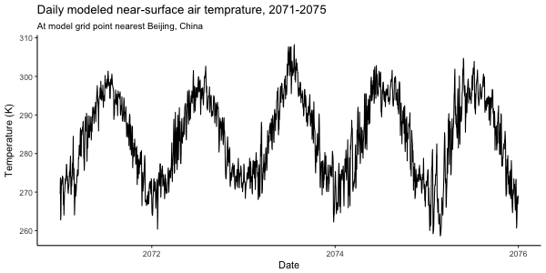
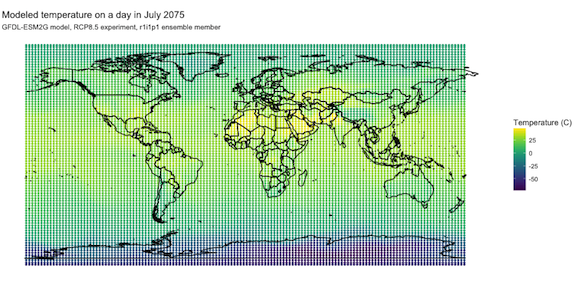
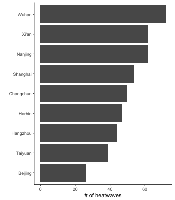
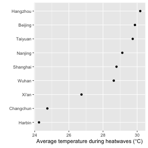

Climate model output files are available for CMIP5 in the netCDF file format. This vignette explains how files in this format can be opened and worked with in R to generate the required delimited format to use with the `futureheatwaves` package. 

## Downloading netCDF files for CMIP5

The Coupled Model Intercomparison Project is a key source of climate model output data for researchers studying the potential impact of climate change. This project is currently in its fifth phase (CMIP5). You can download netCDF files from CMIP5 from the World Climate Research Programme CMIP5 website at https://pcmdi.llnl.gov/search/cmip5/, hosted by the Department of Energy's Lawrence Livermore National Laboratory. The data is stored distributed across multiple data nodes at different institutions, but this and other data portals allow access to all available data through one website. You will need to register to download climate model output data. 

There are a number of parameters that can be used to search files, including:

- **"Institute"**: The climate modeling group that created the climate model. A list with the full names and IDs for each of these is available at http://cmip-pcmdi.llnl.gov/cmip5/docs/CMIP5_modeling_groups.pdf. Output from a few groups is restricted to non-commercial use. Several institutes have multiple models.
- **"Climate model"**: The name of the climate model used to produce the output. Chapter 9 of the Intergovernmental Panel on Climate Change (IPCC)'s Fifth Assessment Report provides an evaluation of climate models [available at https://www.ipcc.ch/pdf/assessment-report/ar5/wg1/WG1AR5_Chapter09_FINAL.pdf; @IPCCch9]. 
- **"Experiment"**: The scenario of external, time-varying values (e.g., greenhouse gas concentrations) that are input to the model. Standard experiments are "historical" (uses observed values from [year] to [year] as model inputs), [control-- "historicalMisc?"] (uses values from a scenario of pre-Industrial concentrations [?] from [year] to [year]), "rcp45" (uses concentrations based on a scenario of ... from [year] to [year]), and "rcp85" (uses concentrations based on a scenario of ... from [year] to [year]). For more information on the CMIP5 experiment design, see Taylor et al. [-@taylor2012overview] and  http://cmip-pcmdi.llnl.gov/cmip5/experiment_design.html. 
- **"Time frequency"**: The time step of model output (e.g., day, month, year)
- **"Ensemble"**: The ensemble member. Many climate models are run with multiple ensemble members, to allow exploration of uncertainty related to internal climate variability. For different ensemble member run for a climate model and experiment, the initial conditions are changed by a small amount, but the model and time-varying inputs are identical. The most common ensemble member is "ri1ip1". 
- **"Variable"**: The variable output by the model. Examples available at the near-surface include "tas" (near-surface air temperature), "tasmin" (daily minimum near-surface air temperature), "tasmax" (daily maximum near-surface air temperature), "hurs" (near-surface relative humidity), "pr" (precipitation). Explanations of variable abbreviations are available at http://cmip-pcmdi.llnl.gov/cmip5/docs/standard_output.pdf. 

You can download files from https://pcmdi.llnl.gov/search/cmip5/ using a point-and-click interface, but you can also use their ... [search API] to create a wget script that can be used to download many files at once and to later update files by only downloading those that have changed since the last download. These climate model output files can be very large, so be sure you have adequate disk space before downloading.

## Working with netCDF files in R

To try out the examples in this section, you will need to download the following climate model output file to your own computer from https://pcmdi.llnl.gov/search/cmip5/ and save it in a "tmp" subdirectory of your home directory: 

- tas_day_GFDL-ESM2G_historical_r1i1p1_19860101-19901231.nc

Three R packages--- `ncdf4`, `ncdf4.helpers`, and `PCICt`---provide useful tools for working with netCDF climate model output files. 

```{r eval = FALSE, message = FALSE, warning = FALSE}
library(ncdf4)
library(ncdf4.helpers)
library(PCICt)
```

Some of the standard tidyverse packages are also helpful and should be loaded to run the example code in this vignette: 

```{r message = FALSE, warning = FALSE, eval = FALSE}
library(readr)
library(dplyr)
library(tidyr)
library(ggplot2)
```

As an example, say you have a climate model output file saved locally called "tas_day_GFDL-ESM2G_historical_r1i1p1_19860101-19901231.nc". As a note, the CMIP5 file names encode information about the climate model output given in the file, including the variable (here, "tas", the near-surface air temperature), the experiment ("historical"), the dates covered by the output (Jan. 1, 1986 to Dec. 31, 1990), the climate model ("GFDL-ESM2G", from the NOAA Geophysical Fluid Dynamics Laboratory), the time step of the output ("day"), and the ensemble member ("r1i1p1").

You can use the `nc_open` function from the `ncdf4` package to open a connection to a netCDF file. The version of netCDF changed from version 3 to version 4 in 2008, and some R packages for netCDF files will only work with the older version 3, but the `ncdf4` package can work with either. 

```{r eval = FALSE}
climate_filepath <- paste0("~/tmp/tas_day_GFDL-ESM2G_historical",
                           "_r1i1p1_19860101-19901231.nc")
climate_output <- nc_open(climate_filepath)
```

The `nc_open` function opens a connection to the netCDF file, but does not read all the data in the file into memory. Instead, this function reads into memory some information about the file, and it opens a connection that can be used in conjunction with other commands to read in specific parts of the data. Once you no longer need the file connection, you should close the connection with `nc_close`.

If you print the object created by `nc_open`, you will get some metadata on the file, including the variables that are available in the file, which are used for dimensions, and what units each are in:

```{r eval = FALSE}
climate_output
```

```
## File ~/tmp/tas_day_GFDL-ESM2G_historical_r1i1p1_19860101-19901231.nc (NC_FORMAT_64BIT):
## 
##      8 variables (excluding dimension variables):
##         double average_DT[time]   
##             long_name: Length of average period
##             units: days
##         double average_T1[time]   
##             long_name: Start time for average period
##             units: days since 1861-01-01 00:00:00
##         double average_T2[time]   
##             long_name: End time for average period
##             units: days since 1861-01-01 00:00:00
##         float tas[lon,lat,time]   
##             long_name: Near-Surface Air Temperature
##             units: K
##             valid_range: 100
##              valid_range: 400
##             cell_methods: time: mean
##             coordinates: height
##             missing_value: 1.00000002004088e+20
##             _FillValue: 1.00000002004088e+20
##             standard_name: air_temperature
##             original_units: deg_k
##             original_name: t_ref
##             cell_measures: area: areacella
##             associated_files: baseURL: http://cmip-pcmdi.llnl.gov/CMIP5/dataLocation areacella: areacella_fx_GFDL-ESM2G_historical_r0i0p0.nc
##         double time_bnds[bnds,time]   
##             long_name: time axis boundaries
##             units: days since 1861-01-01 00:00:00
##         double height[]   
##             units: m
##             positive: up
##             long_name: height
##             standard_name: height
##             axis: Z
##         double lat_bnds[bnds,lat]   
##         double lon_bnds[bnds,lon]   
## 
##      4 dimensions:
##         time  Size:1825   *** is unlimited ***
##             long_name: time
##             units: days since 1861-01-01 00:00:00
##             cartesian_axis: T
##             calendar_type: noleap
##             calendar: noleap
##             bounds: time_bnds
##             standard_name: time
##             axis: T
##         lat  Size:90
##             long_name: latitude
##             units: degrees_north
##             standard_name: latitude
##             axis: Y
##             bounds: lat_bnds
##         lon  Size:144
##             long_name: longitude
##             units: degrees_east
##             standard_name: longitude
##             axis: X
##             bounds: lon_bnds
##         bnds  Size:2
##             long_name: vertex number
##             cartesian_axis: N
## 
##     27 global attributes:
##         title: NOAA GFDL GFDL-ESM2G, historical (run 1) experiment output for CMIP5 AR5
##         institute_id: NOAA GFDL
##         source: GFDL-ESM2G 2010 ocean: TOPAZ (TOPAZ1p2,Tripolar360x210L63); atmosphere: AM2 (AM2p14,M45L24); sea ice: SIS (SISp2,Tripolar360x210L63); land: LM3 (LM3p7_cESM,M45)
##         contact: gfdl.climate.model.info@noaa.gov
##         project_id: CMIP5
##         table_id: Table day (31 Jan 2011)
##         experiment_id: historical
##         realization: 1
##         modeling_realm: atmos
##         tracking_id: d5867000-34f6-4440-b05b-7c27b96f07d1
##         Conventions: CF-1.4
##         references: The GFDL Data Portal (http://nomads.gfdl.noaa.gov/) provides access to NOAA/GFDL's publicly available model input and output data sets. From this web site one can view and download data sets and documentation, including those related to the GFDL coupled models experiments run for the IPCC's 5th Assessment Report and the US CCSP.
##         comment: GFDL experiment name = ESM2G-C2_all_historical_HC2. PCMDI experiment name = historical (run1). Initial conditions for this experiment were taken from 1 January of year 1861 of the parent experiment, ESM2G-C2_1700-1860_historical_HC2, which is an unpublished experiment branched from 1 January of year 1 of 1860 control model experiment, ESM2G_pi-control_C2 (piControl). This parent experiment is an extension of piControl except historical transitions of land use are applied from 1700-1860 in order to allow the terrestrial carbon stores to respond to the imposition of land use and produce realistic fluxes by the start of the historical run in 1861. Several forcing agents varied during the 145 year duration of the ESM2G-C2_all_historical_HC2 experiment in a manner based upon observations and reconstructions for the late 19th and 20th centuries. The aerosol concentrations were computed by an off-line model. The time varying forcing agents include the well-mixed greenhouse gases (CO2, CH4, N2O, halons), tropospheric and stratospheric O3, aerosol concentrations (sulfate, black and organic carbon, sea salt, dust), volcanic aerosols, solar irradiance and land use transitions. The direct effect of tropospheric aerosols is calculated by the model, but not the indirect effects.
##         gfdl_experiment_name: ESM2G-C2_all_historical_HC2
##         creation_date: 2011-11-19T19:42:38Z
##         model_id: GFDL-ESM2G
##         branch_time: 58765
##         experiment: historical
##         forcing: GHG,SD,Oz,LU,Sl,Vl,SS,BC,MD,OC (GHG includes CO2, CH4, N2O, CFC11, CFC12, HCFC22, CFC113)
##         frequency: day
##         initialization_method: 1
##         parent_experiment_id: historicalMisc
##         physics_version: 1
##         product: output1
##         institution: NOAA GFDL(201 Forrestal Rd, Princeton, NJ, 08540)
##         history: File was processed by fremetar (GFDL analog of CMOR). TripleID: [exper_id_eDfXZpMNeR,realiz_id_rexsamlwoA,run_id_bSxBCxpGE5]
##         parent_experiment_rip: r1i1p1
```

Once you know the names of variables in the file, you can use the `ncvar_get` function to read all values of that variable into an R object. For example, to get all the values of longitude and latitude in the example file, which define two of the dimensions of the array for the temperature values reported in the file, you can run:

```{r eval = FALSE}
lon <- ncvar_get(climate_output, varid = "lon")
lat <- ncvar_get(climate_output, varid = "lat")

summary(lon)
```

```
##    Min. 1st Qu.  Median    Mean 3rd Qu.    Max. 
##    1.25   90.63  180.00  180.00  269.40  358.80
```

```{r eval = FALSE}
summary(lat)
```

```
##    Min. 1st Qu.  Median    Mean 3rd Qu.    Max. 
##  -89.49  -45.00    0.00    0.00   45.00   89.49
```

In addition to the longitude and latitude dimensions, the climate model output files also include a time dimension. The metadata for the file includes information on how this time is reported, which is typically in days since some origin date for climate model output. This information is included in the `$dim$time$units` element of the R object returns with `nc_open`:

```{r eval = FALSE}
climate_output$dim$time$units
```

```
## [1] "days since 1861-01-01 00:00:00"
```

While the R function `as.Date` allows the user to specify an origin to compute a date, this function typically will not work correctly with climate model output files, as climate models often provide output using calendars other than the standard Gregorian calendar. Climate model output can be tied to a number of different calendars, including a "no-leap" calendar, which omits leap days from the calendar, a 360-day calendar, which uses 30-day months for all 12 months, and a number of other calendars. You can determine the calendar used to a netCDF file from the `$dim$time$calendar` element of the R object returns with `nc_open`:

```{r eval = FALSE}
climate_output$dim$time$calendar
```

```
## [1] "noleap"
```

This use of non-standard calendars messes up the calculations of `as.Date`, so you must use a more specialized function to read in the time variable of the climate model output and map it to standard calendar dates. You can do this with the `nc.get.time.series` function from the `ncdf4.helpers` package (you should also load the `PCICt` package to use this function): 

```{r eval = FALSE}
tas_time <- nc.get.time.series(climate_output, v = "tas",
                               time.dim.name = "time")
tas_time[c(1:3, length(tas_time) - 2:0)]
```

```
## [1] "1986-01-01 12:00:00" "1986-01-02 12:00:00" "1986-01-03 12:00:00"
## [4] "1990-12-29 12:00:00" "1990-12-30 12:00:00" "1990-12-31 12:00:00"
```

The longitude, latitude, and time variables define the dimensions for the climate model output, which for this file is the [tas] at a specific grid point (longitude, latitude) and day (time). You can read in this main variable using `ncvar_get`: 

```{r eval = FALSE}
tas <- ncvar_get(climate_output, "tas")
```

This variable is in a 3-dimensional array, with dimensions ordered as first longitude, then latitude, then time: 

```{r eval = FALSE}
dim(tas)
```

```
## [1]  144   90 1825
```

```{r eval = FALSE}
length(lon)
```

```
## [1] 144
```

```{r eval = FALSE}
length(lat)
```

```
## [1] 90
```

```{r eval = FALSE}
length(tas_time)
```

```
## [1] 1825
```

Once you have read all variables into R objects, you can close the file using: 

```{r eval = FALSE}
nc_close(climate_output)
```

You can use indexing to pull the modeled temperature at a certain location and time step. For example, Beijing, China, is at latitude 39.9 degrees north and 116.4 degrees east. To get the value of the modeled temperature on July 7, 1986, at the model grid point closest to Beijing, you can run (the units on the output are Kelvin):

```{r eval = FALSE}
lon_index <- which.min(abs(lon - 116.4))
lat_index <- which.min(abs(lat - 39.9))
time_index <- which(format(tas_time, "%Y-%m-%d") == "1986-07-01")
tas[lon_index, lat_index, time_index]
```

```
## [1] 294.8351
```

To get the full time series of modeled temperature at the grid point closest to Beijing, you can run: 

```{r eval = FALSE, fig.width = 6, fig.height = 3, echo = c(1:3, 5:8)}
beijing_output <- data_frame(time = tas_time,
                             tas = tas[lon_index, lat_index, ]) %>%
        mutate(time = as.Date(format(time, "%Y-%m-%d")))
png("figures/beijing_timeseries.png", height = 300, width = 600)
beijing_output %>%
        ggplot(aes(x = time, y = tas)) + 
        geom_point(alpha = 0.7) + 
        xlab("Date") + ylab("Temperature (K)")
dev.off()
```

```{r echo = FALSE}

```

Note that this code uses `format` and `as.Date` to convert the PCICt object to a date object, to allow use of a date axis when plotting with `ggplot2`.

To get the modeled temperature on July 1, 1986, at all grid point locations, you can run: 

```{r eval = FALSE}
july_1_1986 <- tas[ , , time_index]
july_1_1986[1:3, 1:3]
```

```
##          [,1]     [,2]     [,3]
## [1,] 216.6672 217.9258 220.4663
## [2,] 216.6740 217.6868 219.7293
## [3,] 216.6812 217.2043 218.4953
```

This data is a two-dimensional matrix, where the column is specific to longitude and the row to latitude. To tidy this data to make it easier to map with `ggplot2`, you can use `expand.grid` to create a dataframe with every combination of longitude and latitude, and then use `as.vector` with the temperature values for July 1, 1986, to add temperature values at each of these longitudes and latitudes. Because the longitude dimension precedes the latitude dimension in the `tas` array, it should be put first in the `expand.grid` so that longitude and latitude values align correctly with the unlisted temperature data. Longitude should be mutated to have values between -180 and 180 (in the original data, it is between 0 and 360) to work better with `ggplot2` mapping. 

```{r eval = FALSE}
all_coords <- expand.grid(lon, lat) %>%
        rename(lon = Var1, lat = Var2) %>%
        mutate(lon = ifelse(lon > 180, -(360 - lon), lon),
               tas = as.vector(july_1_1986))
```

This modeled temperature data for a single day can be mapped using `ggmap` and `ggplot2` functions (the `viridis` package is also used here for the color scale and the `weathermetrics` package to convert the temperature from Kelvin to Celsius):

```{r eval = FALSE, fig.width = 8, fig.height = 4, message = FALSE, warning = FALSE, echo = c(1:4, 6:16)}
library(ggmap)
library(viridis)
library(weathermetrics)

png("figures/worldmap.png", height = 400, width = 800)
all_coords %>% 
        mutate(tas = convert_temperature(tas, "k", "c")) %>%
        ggplot() + 
        borders("world", colour="gray50", fill="gray50") + 
        geom_point(aes(x = lon, y = lat, color = tas),
                   size = 0.7) + 
        scale_color_viridis(name = "Temperature (C)") + 
        theme_void() + 
        coord_quickmap() + 
        ggtitle("Modeled temperature on July 1, 1986",
                subtitle = "GFDL-ESM2G model, historical experiment, r1i1p1 ensemble member") 
dev.off()
```

```{r echo = FALSE}

```

### Working with climate model output data with other R packages

#### The `RCMIP5` package

The `RCMIP5` package [@RCMIP5] can also be used to work with climate model output data. Some functions in this package only work with monthly or less frequent data (`checkTimePeriod`, `cmip5data`, functions that work with `cmip5data` objects like `filterDimensions` and `getProjectionMatrix`). The package's `getFileInfo` function, however, will work with CMIP5 files of any time step; this function identifies all CMIP5 files in a directory and creates a dataframe that parses the information contained in the file name. For example:

```{r eval = FALSE}
library(RCMIP5)
getFileInfo("~/tmp")
```

```
##                   path
## 1 /Users/_gbanders/tmp
## 2 /Users/_gbanders/tmp
## 3 /Users/_gbanders/tmp
## 4 /Users/_gbanders/tmp
##                                                 filename variable domain
## 1 tas_day_GFDL-ESM2G_historical_r1i1p1_19860101-19901231      tas    day
## 2 tas_day_GFDL-ESM2G_historical_r1i1p1_19910101-19951231      tas    day
## 3      tas_day_GFDL-ESM2G_rcp85_r1i1p1_20710101-20751231      tas    day
## 4      tas_day_GFDL-ESM2G_rcp85_r1i1p1_20760101-20801231      tas    day
##        model experiment ensemble              time   size
## 1 GFDL-ESM2G historical   r1i1p1 19860101-19901231 92487K
## 2 GFDL-ESM2G historical   r1i1p1 19910101-19951231 92487K
## 3 GFDL-ESM2G      rcp85   r1i1p1 20710101-20751231 92487K
## 4 GFDL-ESM2G      rcp85   r1i1p1 20760101-20801231 92487K
```

While the `loadCMIP5` function does successfully load the daily data as a `cmip5data` object, it seems that most of the methods for this object type do not do anything meaningful for data at this time resolution.

#### The `wux` package

The `wux` package [@wux] includes functions that allow the user to download CMIP5 monthly-aggregated output directly from within R with the `CMIP5fromESGF` function. However, this function does not allow downloading of climate model output with finer time steps, like daily data. 

This package uses the `models2wux` function to read in climate model output netCDF files and convert to a WUX dataframe that can be used by other functions in the package. While this function can input climate model output with daily time steps, if the element "what.timesteps" of the `modelinput` list input is set to "daily", the function aggregates this data to a monthly or less frequent (e.g., seasonal) aggregation when creating the WUX dataframe. Therefore, while this package provides very useful functionality for working with averaged output of daily climate model output data, it cannot easily be used to identify and characterize multi-day extreme events like heat waves. 

## Processing climate model output data to use with `futureheatwaves`

To try out the examples in this section, you will need to download the following climate model output files to your own computer from https://pcmdi.llnl.gov/search/cmip5/ and save them in a "tmp" subdirectory of your home directory: 

- tas_day_GFDL-ESM2G_historical_r1i1p1_19860101-19901231.nc
- tas_day_GFDL-ESM2G_historical_r1i1p1_19910101-19951231.nc
- tas_day_GFDL-ESM2G_rcp85_r1i1p1_20710101-20751231.nc
- tas_day_GFDL-ESM2G_rcp85_r1i1p1_20760101-20801231.nc

The `futureheatwaves` package requires that climate output files are in a certain output to be processed. The data in the climate model output netCDF must be saved in three files: one for time, one for grid point location (latitude and longitude), and one for the climate model output variable (e.g., temperature in the example file used in this case). 

The following function can be used to correctly format and save the data from the climate model output netCDF file in a way that will allow processing by the `futureheatwaves` package. Note that, when the data for a single ensemble member of one climate model and experiment is split across multiple files, the data from later files should be appended to the delimited file written out with data from the first file. Further, if you are only studying a certain region, you can subset the climate model output to just the latitude-longitude ranges of that region before writing out delimited files, which will save space for saving those files. In this example, we have subset data to latitude-longitude ranges appropriate for China (70 to 140 degrees east for longitude and 15 to 60 degrees north for latitude). 

```{r message = FALSE, warning = FALSE, eval = FALSE}
# Load required libraries
library(ncdf4)
library(ncdf4.helpers)
library(PCICt)
library(readr)
library(dplyr)
library(tidyr)

#' Function to process CMIP5 netCDF files to format required by 
#'    `futureheatwaves` package
#'
#' filepath: A character vector giving the path to the netCDF 
#'    climate model output file
#' output_dir: A character vector giving the path to the directory 
#'    where output should be saved
#' var: The climate model variable ("tas" is near-surface air temperature)
#' append: Logical specifying whether results should be appended to 
#'     existing files in the output directory
#' lon_range: If not NULL, a length two numerical vector giving the range
#'    of longitudes to be saved. Values should be in degrees east in the 
#'    0 to 360 degree range.
#' lat_range: If not NULL, a length two numerical vector giving the range
#'    of latitudes to be saved. Values should be in degrees north in the 
#     -90 to 90 range. 
process_cmip5_file <- function(filepath, output_dir, 
                               var = "tas",
                               append = FALSE, 
                               lon_range = NULL, 
                               lat_range = NULL){
        # Open netCDF connection, read in dimensions and climate variable
        climate_output <- ncdf4::nc_open(filepath)
        lon <- ncdf4::ncvar_get(climate_output, "lon")
        lat <- ncdf4::ncvar_get(climate_output, "lat")
        tas_time <- ncdf4.helpers::nc.get.time.series(climate_output, 
                                                      v = var,
                                                      time.dim.name = "time")
        tas <- ncdf4::ncvar_get(climate_output, var)
        ncdf4::nc_close(climate_output)
        
        # Print out converted time and filepath name to ensure that 
        # time was converted correctly based on calendar
        cat(paste("First and last two dates processed for file named\n",
                  filepath, "are:\n"))
        print(format(tas_time[c(1:2, length(tas_time) - 1:0)],
                     "%Y-%m-%d"))
        
        # If requested, limit to certain ranges of latitude and/or longitude
        if(!is.null(lon_range)){
                lon_range <- sort(lon_range)
                lon_index <- which(lon_range[1] <= lon & 
                                           lon <= lon_range[2]) 
                lon <- lon[lon_index]
                tas <- tas[lon_index, , ]
        }
        if(!is.null(lat_range)){
                lat_range <- sort(lat_range)
                lat_index <- which(lat_range[1] <= lat & 
                                           lat <= lat_range[2]) 
                lat <- lat[lat_index]
                tas <- tas[ , lat_index, ]
        }
        
        # Change to appropriate format for futureheatwaves package
        time_output <- dplyr::data_frame(index = 1:length(tas_time),
                                         time = format(tas_time, 
                                                       "%Y-%m-%d")) %>%
                tidyr::separate(time, c("year", "month", "day")) %>%
                dplyr::mutate(year = as.integer(year),
                              month = as.integer(month),
                              day = as.integer(day))
        coordinate_output <- expand.grid(lon, lat) %>%
                dplyr::rename("lon" = Var1) %>%
                dplyr::rename("lat" = Var2) %>%
                dplyr::select(lat, lon)
        tas_output <- matrix(unlist(tas), 
                             ncol = length(lon) * length(lat),
                             byrow = TRUE) %>%
                as.data.frame()
        
        # Write out to files
        if(!append & !dir.exists(output_dir)){
                dir.create(output_dir, recursive = TRUE)
        }
        readr::write_csv(time_output, 
                         path = paste0(output_dir, "/time_day.csv"),
                         col_names = FALSE, append = append)
        if(!append){
                readr::write_csv(coordinate_output, 
                         path = paste0(output_dir,
                                       "/latitude_longitude_day.csv"),
                         col_names = FALSE)
        }
        readr::write_csv(tas_output,
                         path = paste0(output_dir, "/tas_day.csv"),
                         col_names = FALSE, append = append)
        
        return(NULL)
}
```

Here is an example of using this function to process several CMIP5 netCDF files into the format required by the `futureheatwaves` package and saving the results in a "dataFolder" subdirectory of the "tmp" subdirectory of your home directory:

```{r results = "hold", eval = FALSE}
# Process two historical files for the GFDL-ESM2G model's r1i1p1
# ensemble, historical experiment
process_cmip5_file(filepath = paste0("~/tmp/tas_day_GFDL-ESM2G_",
                                      "historical_r1i1p1_19860101-",
                                      "19901231.nc"),
                    output_dir = "~/tmp/dataFolder/historical/GFDL/r1i1p1",
                    lon_range = c(70, 140),
                    lat_range = c(15, 60))
process_cmip5_file(filepath = paste0("~/tmp/tas_day_GFDL-ESM2G_",
                                      "historical_r1i1p1_19910101-",
                                      "19951231.nc"),
                    output_dir = "~/tmp/dataFolder/historical/GFDL/r1i1p1",
                    lon_range = c(70, 140),
                    lat_range = c(15, 60),
                    append = TRUE)
```

```
## First and last two dates processed for file named
##  ~/tmp/tas_day_GFDL-ESM2G_historical_r1i1p1_19860101-19901231.nc are:
## [1] "1986-01-01" "1986-01-02" "1990-12-30" "1990-12-31"
## NULL
## First and last two dates processed for file named
##  ~/tmp/tas_day_GFDL-ESM2G_historical_r1i1p1_19910101-19951231.nc are:
## [1] "1991-01-01" "1991-01-02" "1995-12-30" "1995-12-31"
## NULL
```

```{r results = "hold", eval = FALSE}
# Process two historical files for the GFDL-ESM2G model's r1i1p1
# ensemble, RCP8.5 experiment
process_cmip5_file(filepath = paste0("~/tmp/tas_day_GFDL-ESM2G_",
                                     "rcp85_r1i1p1_20710101-20751231.nc"),
                    output_dir = "~/tmp/dataFolder/rcp85/GFDL/r1i1p1",
                    lon_range = c(70, 140),
                    lat_range = c(15, 60))
process_cmip5_file(filepath = paste0("~/tmp/tas_day_GFDL-ESM2G_",
                                     "rcp85_r1i1p1_20760101-20801231.nc"),
                    output_dir = "~/tmp/dataFolder/rcp85/GFDL/r1i1p1",
                    lon_range = c(70, 140),
                    lat_range = c(15, 60),
                    append = TRUE)
```

```
## First and last two dates processed for file named
##  ~/tmp/tas_day_GFDL-ESM2G_rcp85_r1i1p1_20710101-20751231.nc are:
## [1] "2071-01-01" "2071-01-02" "2075-12-30" "2075-12-31"
## NULL
## First and last two dates processed for file named
##  ~/tmp/tas_day_GFDL-ESM2G_rcp85_r1i1p1_20760101-20801231.nc are:
## [1] "2076-01-01" "2076-01-02" "2080-12-30" "2080-12-31"
## NULL
```

The data can now be processed by the `futureheatwaves` package. For example, to identify and characterize all heatwaves between 1986 and 1990 at the cities listed in the "chinese_cities.csv" file that comes with the package:

```{r eval = FALSE}
library(futureheatwaves)
city_file_location <- system.file("extdata/chinese_cities.csv",
                                 package = "futureheatwaves")
gen_hw_set(out = "~/tmp/example_results",
           dataFolder = "~/tmp/dataFolder",
           dataDirectories = list("historical" = c(1986, 1995),
                                  "rcp85" = c(2071, 2080)),
           citycsv = city_file_location,
           coordinateFilenames = "latitude_longitude_day.csv",
           tasFilenames = "tas_day.csv",
           timeFilenames = "time_day.csv",
           thresholdBoundaries = c(1986, 1995),
           projectionBoundaries = c(2071, 2080),
           referenceBoundaries = c(1986, 1995),
           printWarning = FALSE)
```

```
## Processing thresholds for GFDL 
## Reading ---> r1i1p1 
## Read operation complete 
## Processing references for GFDL 
## Reading ---> r1i1p1 
## Read operation complete 
## Processing projections for GFDL 
## Reading ---> r1i1p1 
## Read operation complete 
## Creating dataframe ~~ City:  Shanghai  ~~ City Number:  1  ~~ Cutoff:  300.9392 
## Creating dataframe ~~ City:  Beijing  ~~ City Number:  2  ~~ Cutoff:  300.7005 
## Creating dataframe ~~ City:  Lanzhou  ~~ City Number:  3  ~~ Cutoff:  289.9989 
## Creating dataframe ~~ City:  Xi'an  ~~ City Number:  4  ~~ Cutoff:  298.5163 
## Creating dataframe ~~ City:  Harbin  ~~ City Number:  5  ~~ Cutoff:  295.8038 
## Creating dataframe ~~ City:  Nanjing  ~~ City Number:  6  ~~ Cutoff:  300.9024 
## Creating dataframe ~~ City:  Wuhan  ~~ City Number:  7  ~~ Cutoff:  300.1856 
## Creating dataframe ~~ City:  Taiyuan  ~~ City Number:  8  ~~ Cutoff:  300.7942 
## Creating dataframe ~~ City:  Changchun  ~~ City Number:  9  ~~ Cutoff:  296.1751 
## Creating dataframe ~~ City:  Hangzhou  ~~ City Number:  10  ~~ Cutoff:  302.5694 
## Writing GFDL: r1i1p1
## Writing accumulators 
## All operations completed. Exiting.
```

```
##   modelName length.histens. length.rcpens.
## 1      GFDL               1              1
```

You can then work with this output as with any output from `gen_hw_set`. For example, if using the development version of `futureheatwaves` available through GitHub, you can create a plot of city and matching grid point locations using:

```{r eval = FALSE, message = FALSE, fig.width = 6, fig.height = 6, echo = c(1, 3)}
out <- "~/tmp/example_results"
png("figures/map_ggmap.png", height = 500, width = 500)
map_grid_ggmap(plot_model = "GFDL", out = out)
dev.off()
```

```{r echo = FALSE}

```

You can use `apply_all_models` to apply functions to explore the heatwave output. For example, you can determine the number of heatwaves in each community and the average temperature of heatwaves in each community using: 

```{r eval = FALSE, message = FALSE, echo = c(1:2, 4:12)}
library(forcats)
library(ggplot2)
png("figures/number_of_heatwaves.png", height = 400, width = 350)
apply_all_models(out = out, FUN = number_of_heatwaves,
                 city_specific = TRUE) %>%
        mutate(city = fct_reorder(city, value)) %>%
        ggplot(aes(x = city, y = value)) + 
        geom_bar(stat = "identity") + 
        coord_flip() + 
        theme_classic() + 
        ylab("# of heatwaves") + 
        xlab("")
dev.off()
```

```{r echo = FALSE}

```

```{r eval = FALSE, fig.height = 4, fig.width = 4, echo = c(2:10)}
png("figures/average_heatwave_temp.png", height = 300, width = 300)
apply_all_models(out = out, FUN = average_mean_temp,
                 city_specific = TRUE) %>%
        mutate(value = convert_temperature(value, "k", "c")) %>%
        mutate(city = fct_reorder(city, value)) %>%
        ggplot(aes(x = value, y = city)) + 
        geom_point() +  
        ylab("") + 
        xlab(expression(paste("Average temperature during heatwaves (",
                              degree*C, ")")))
dev.off()
```

```{r echo = FALSE}

```

## References
